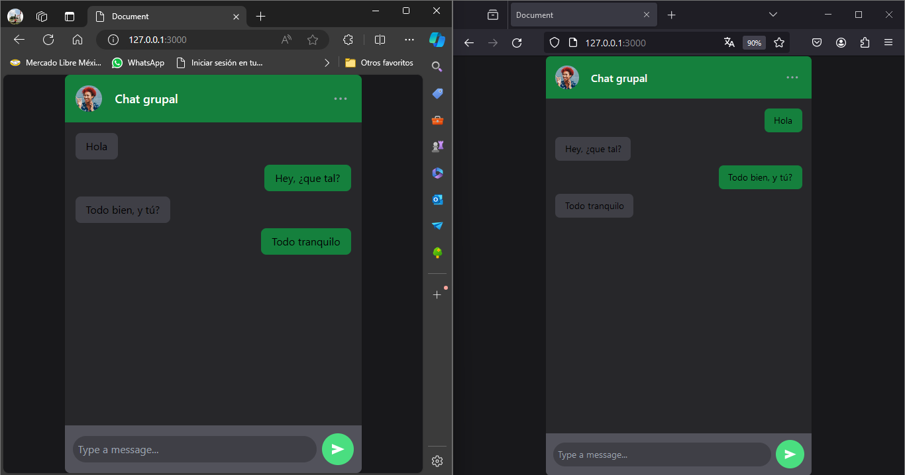

# Chat sockets
Un chat con mensajes temporales que se mantienen hasta finalizar la ejecución del programa.

### Tecnologías utilizadas:
* HTML5
* JavaScript
* NodeJS
* TailwindCSS
* Express
  
### Captura de pantalla

#### Referencias
La idea ha surgido del siguiente bloc:
https://www.freecodecamp.org/espanol/news/como-construir-una-aplicacion-de-chat-en-tiempo-real-en-node-js-usando-express-mongoose-and-socket-io/